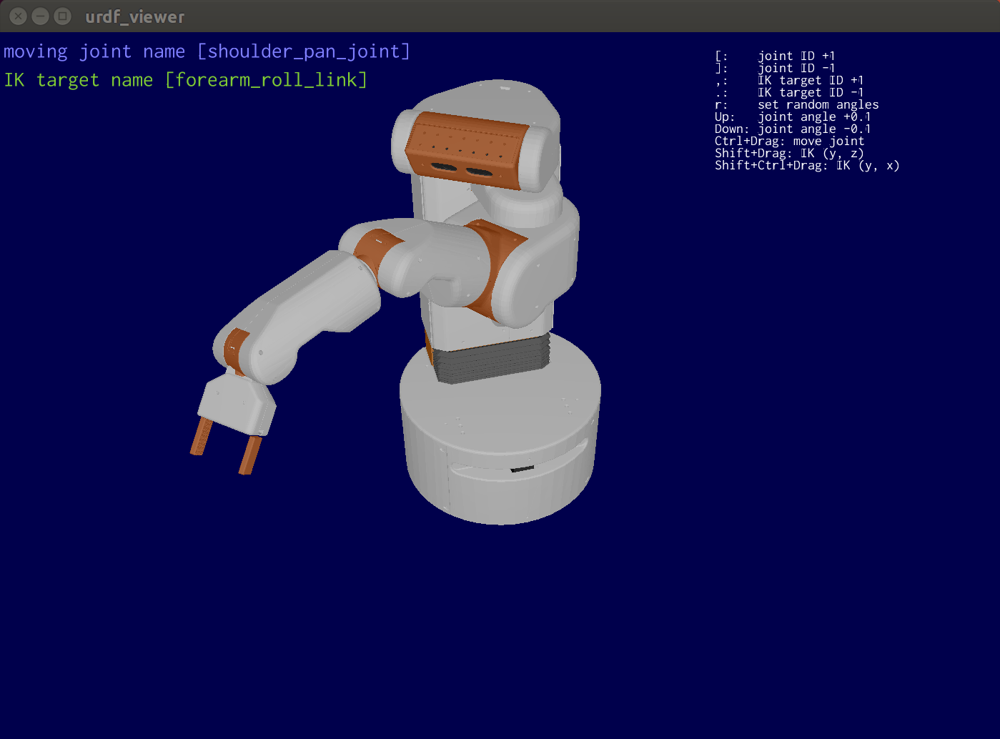
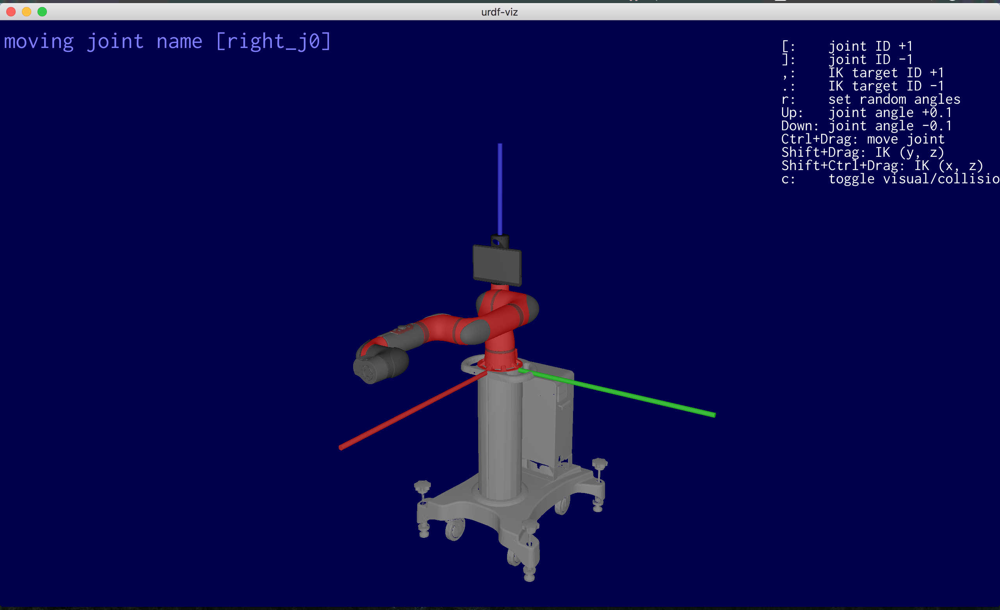
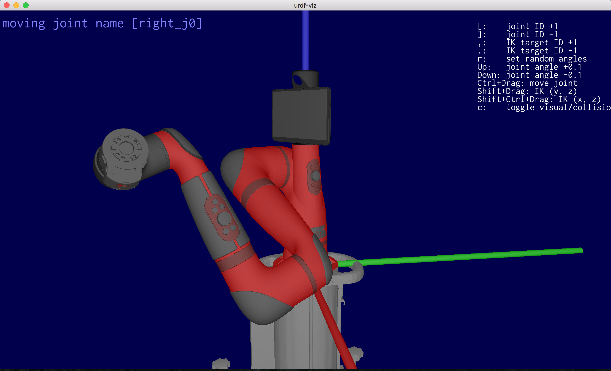
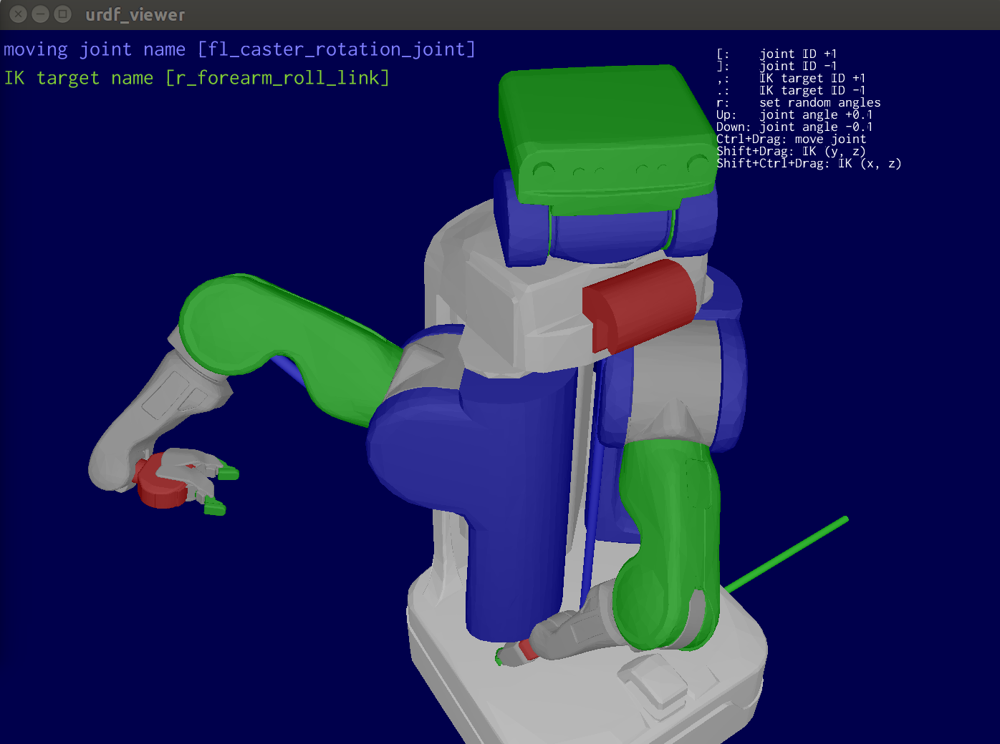
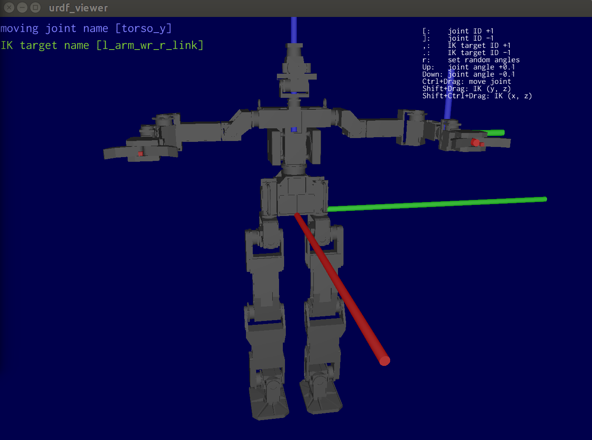
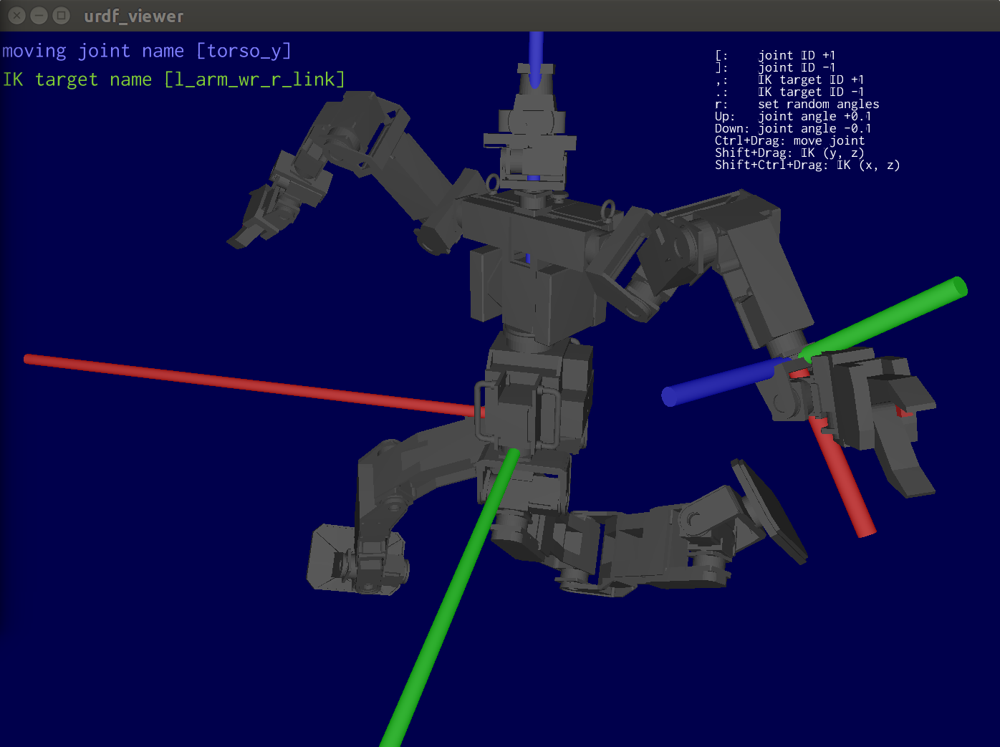
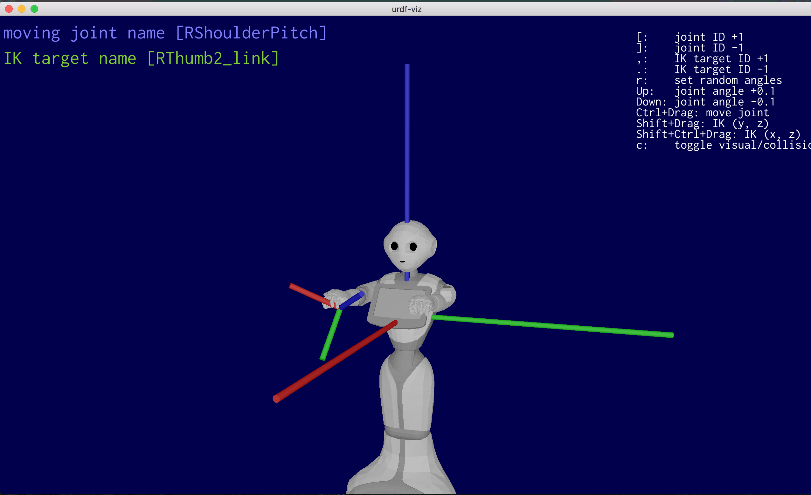
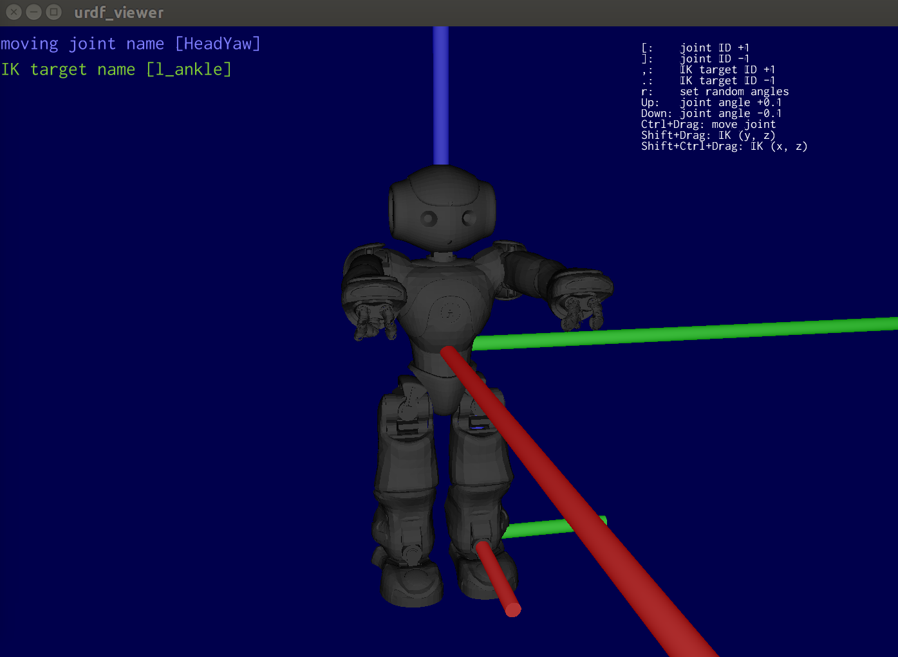

# urdf-viz [](https://travis-ci.org/OTL/urdf-viz) [](https://ci.appveyor.com/project/OTL/urdf-viz) [](https://crates.io/crates/urdf-viz)

Visualize [URDF(Unified Robot Description Format)](http://wiki.ros.org/urdf) file.
`urdf-viz` is written in Rust-lang.

## Install

### Install with `cargo`

If you are using rust-lang already and `cargo` is installed, you can install by `cargo install`.

```bash
cargo install urdf-viz
```

#### (FYI) Install `cargo`

```bash
curl https://sh.rustup.rs -sSf | sh
```

and follow the instruction of the installer.

## Pre-requirements for build

### On Linux

If you have not installed ROS, you may need cmake, xorg-dev, glu to
compile assimp-sys and glfw-sys.

```bash
sudo apt-get install cmake xorg-dev libglu1-mesa-dev
```

### On Windows

You need freetype.lib in your PATH, which is required by `freetype-sys`.
You can find binaries [here](https://github.com/PistonDevelopers/binaries)

### On MacOS

Install freetype by brew.

```bash
brew install freetype
```

## Download binary

If you don't want to install `rust` and `cargo`, you can find
binary releases of `urdf-viz` for Ubuntu16.04/14.04 64bit, Windows, MacOS [here](https://github.com/OTL/urdf-viz/releases).

## How to use

`urdf-viz` command will be installed.
It needs `rosrun` and `rospack` to resolve `package://` in `<mesh>` tag, and
it uses `xacro` to convert `.xacro` file into urdf file.
It means you need `$ source ~/catkin_ws/devel/setup.bash` or something before using `urdf-viz`.


```bash
urdf-viz URDF_FILE.urdf
```

It is possible to use xacro file directly.
It will be converted by `rosrun xacro xacro` inside of `urdf-viz`.

```bash
urdf-viz XACRO_FILE.urdf.xacro
```

For other options, please read the output of `-h` option.

```bash
urdf-viz -h
```

If there are no "package://" in mesh tag, and don't use xacro you can skip install of ROS.

## GUI Usage

In the GUI, you can do some operations with keyboard and mouse.

* Move a joint
  * set the angle of a joint by `Up`/`Down` key
  * `Ctrl` + Drag to move the angle of a joint
  * change the joint to be moved by `[` and `]`
* Inverse kinematics (only positions)
  * `Shift` + Drag to use inverse kinematics(Y and Z axis)
  * `Shift` + `Ctrl` + Drag to use inverse kinematics(X and Z axis)
  * change the move target for inverse kinematics by `,` or `.`
* `r` key to set random joints
* Move view point
  * Mouse Right Drag to translate view camera position
  * Mouse Left Drag to look around
  * Scroll to zoom in/out

## Gallery




















## Dependencies

* [kiss3d](https://github.com/sebcrozet/kiss3d): `urdf-viz` is strongly depend on `kiss3d`, which is super easy to use, great 3D graphic engine.
* [nalgabra](https://github.com/sebcrozet/nalgebra): linear algebra library.
* [k](https://github.com/OTL/k): kinematics library which is based on [nalgabra](https://github.com/sebcrozet/nalgebra). It can load URDF files using `urdf-rs`.
* [assimp-rs](https://github.com/Eljay/assimp-rs): assimp rust interface. `kiss3d` supports `.obj` files natively, but urdf contains `dae` or `stl` files. These files are converted to kiss3d mesh model by `assim-rs`
* [urdf-rs](https://github.com/OTL/urdf-rs): URDF file loader.
* [structopt](https://github.com/TeXitoi/structopt): super easy command line arguments parser.

### Build without assimp

You can disable assimp by disable `assimp` feature which is enabled in default.
It can handle `.obj` files even if you disable `assimp`.
`assimp` works on Linux/Windows/MacOS now, we don't need this now.

```bash
cargo build --no-default-features
```
